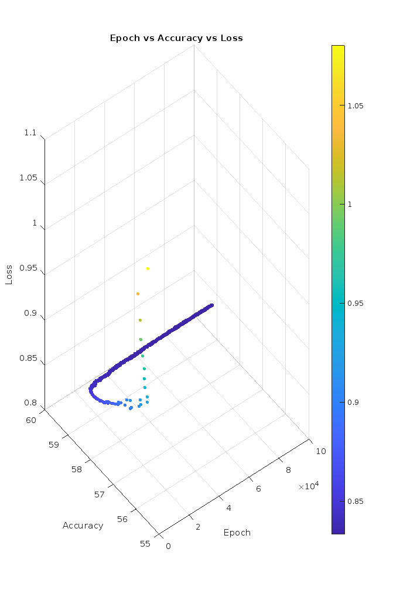

# AAPP (Academic Achievement Prediction Project)

**AAPP** is an open-source personal project developed in C, with all code written from scratch. Its goal is to determine the likelihood of a student achieving an honor (with/high/highest) based on the Philippine grading system, which uses percentage-based grades.

## AAPP-1
- **Predicts** whether a student can achieve an honor (with/high/highest).
- **Use** 3 features which is the general average, attendance difference, achievement average

## What's Inside?
The main code for model training is not included as it is still under improvement. The included files are:
- `Model loader/reader file`
- `Testing file`
- `AAPP-1 Model file`
- `Normalization file for AAPP-1`

## Data Analysis
- **Epoch vs Accuracy vs Loss (100 thousand epoch):**
  
- **Training Time:** 2 hours and 40 minutes and 6 seconds
- **Epochs:** 500 thousand

## Compiler
- **Cxxdroid (Android)**

## Future Objectives
- **AAPP-2**
  - Increase model accuracy
  - Improve model framework for faster training
  - Add new features (e.g., study time, study habits factor)
  - Use real statistics test set for model evaluation
